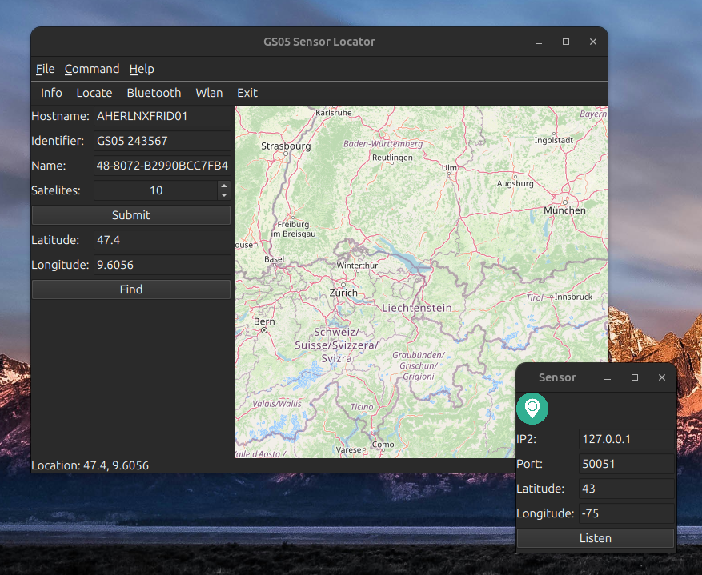
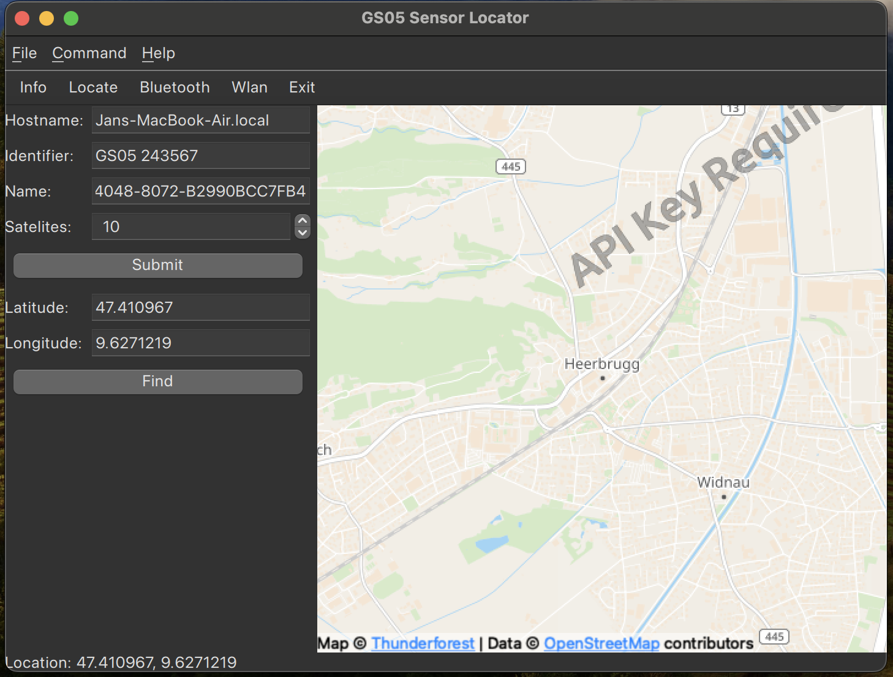

# Toby

Testing application for the sensor interface which takes the positioning data from the gRPC in terface and locate the sensor on the open street map. The IP address and Port is configurable, There is small simulation applicaiton delivered for development to mockup the functionality of the real GNSS sensor.

## Linux platform

## macOS platform (old image)

